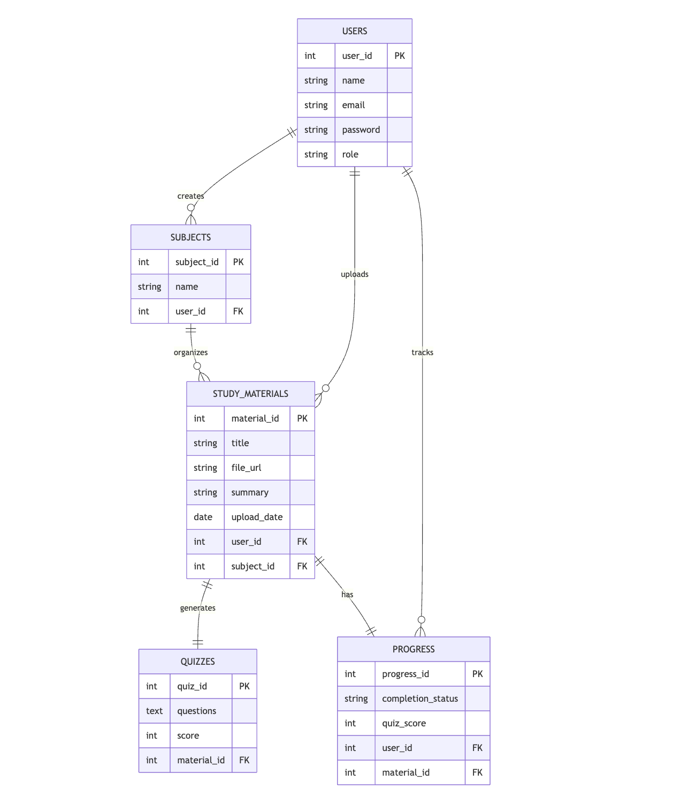

# ER Diagram – AI Study Assistant Platform

The above ER diagram is the representation of the database schema of the AI Study Assistant Platform. It depicts how the users are able to upload and manage study materials based on subjects, create quizzes from study materials, and monitor learning progress.

