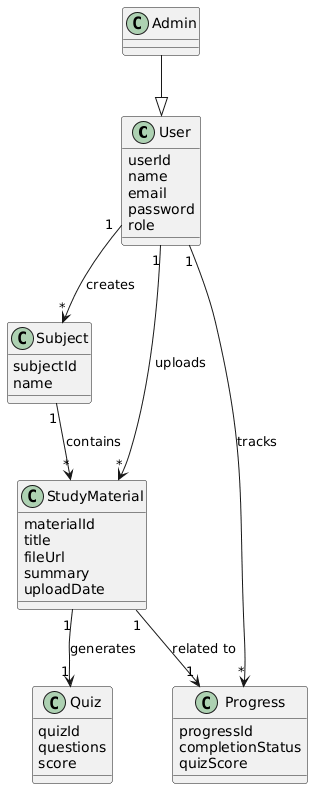

# Class Diagram – AI Study Assistant Platform

The class diagram below illustrates the main entities of the AI Study Assistant platform. The diagram captures the main concepts of the AI Study Assistant platform, including users, study materials, subjects, quizzes, and learning progress.

