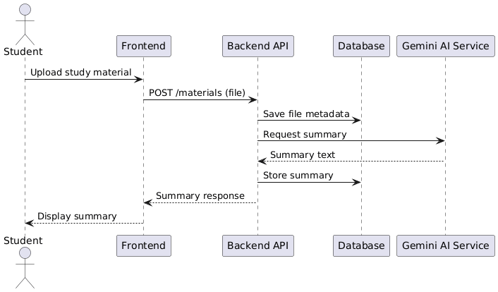

# Sequence Diagram – AI Summary Generation Flow

The sequence diagram below shows the overall workflow of the AI Study Assistant Platform. The student uploads the study material, the system saves the material, transmits the material to the Gemini AI service for summary generation, saves the summary, and finally displays the summary to the student.

