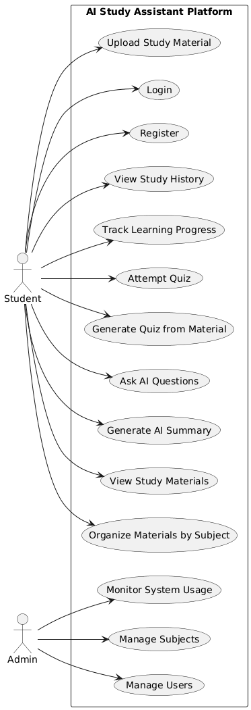

# Use Case Diagram – AI Study Assistant Platform

The use case diagram below illustrates the interaction between students and administrators and the AI Study Assistant Platform. Students are able to upload study materials, produce AI summaries, ask questions, develop quizzes, and monitor their learning progress. Admin users are responsible for managing subjects, users, and system usage.

